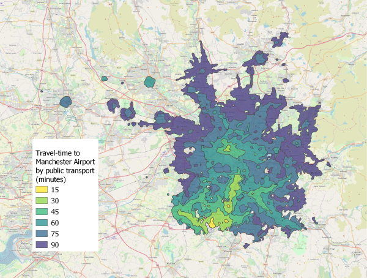

# OpenTripPlanner Tutorial - creating and querying your own multi-modal route planner

This is an introductory tutorial (approx. 3 hours) covering the setup and querying of an OpenTripPlanner instance.

Latest update: 20 January 2021.

[Tutorial in PDF format](https://github.com/marcusyoung/otp-tutorial/blob/master/intro-otp.pdf)

The tutorial consists of four parts:

1. You'll start by building an OTP network graph for the street network and public transport services in Greater Manchester, and then launch your OTP instance and request routes using the web interface.

2. Next, you'll query the OTP Isochrone API to obtain travel-time polygons, visualising the accessibility of Manchester Airport by public transport.

3. You'll then automate querying the OTP route planner API using the [otpr R package](https://github.com/marcusyoung/otpr), looking up route information for each Lower Layer Super Output Area (LSOA) in Greater Manchester.

4. And finally, you'll use the OTP surface analysis API to perform efficient one-to-many analysis and measure the number of jobs accessible from an LSOA.


Note: Currently OTP requires Java 8. This tutorial may not work with later versions of Java.

Note: The GTSF feeds provided in this tutorial for the Greater Manchester area were obtained in December 2020. You will need to take this into account when querying OTP otherwise you may not get any transit routes returned. Ensure that you request a route plan for the period covered by the GTFS feeds.



## How to cite

Please cite this tutorial if you use it for your research. Suggested citation:

```
Young, M. (2021). OpenTripPlanner - creating and querying your own multi-modal route planner.
URL: https://github.com/marcusyoung/otp-tutorial.
```

## Want to say thanks?

<a href="https://ko-fi.com/marcusyoung"></a>

</br>


