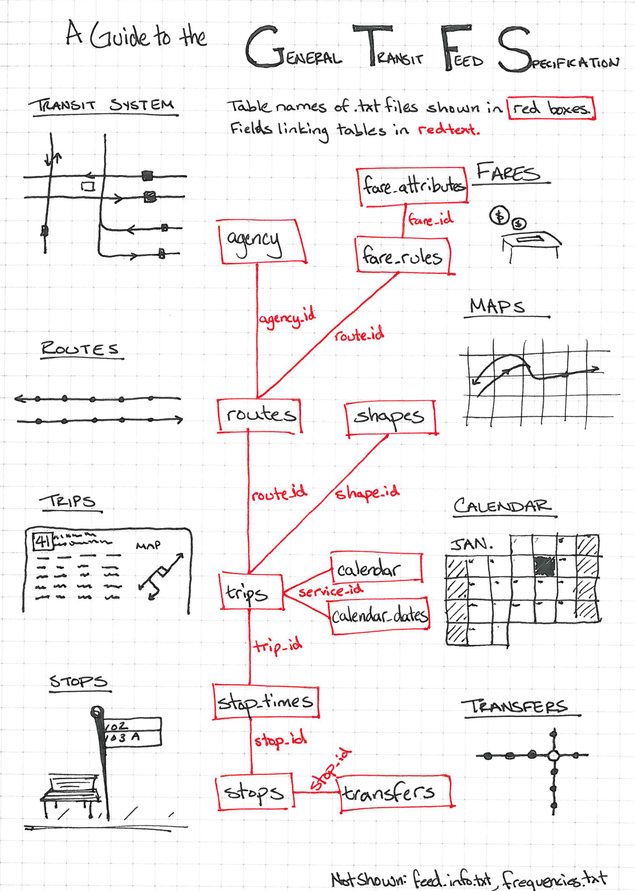

```{r setup, include=FALSE}
knitr::opts_chunk$set(echo = TRUE)
```

## Introduction

This practical session gives an introduction to OpenTripPlanner (OTP) - an open-source and cross-platform multi-modal route planner written in JAVA. OTP uses imported Open Street Map (OSM) data for routing on the street and path network and supports
multi-agency public transport routing through imported GTFS feeds (see Figure \ref{fig:gtfs} for a illustrated guide to GTFS). It can also apply a digital elevation model to the OSM street network, allowing, for example, cycle-friendly routes to be requested. OTP has a web front-end that can be used by end-users, and a sophisticated routing API.

A major advantage of running your own multi-modal route planner is the ability to carry out analysis using amended transport data. Services such as as Google Maps or TransportAPI are based on current public transport schedules and the existing road network. OTP enables you to modify transit schedules and/or make changes to the underlying street network. By editing a local copy of OSM, you can model the effects of opening new roads, closing roads, or imposing other restrictions. You can also look back in time. For example, you might want to examine the effect of reductions in rural bus services on accessibility of health facilities. To do this you would need a network with bus schedules as they were in previous years.

This practical session consists of three parts:

1. You'll start by building an OTP network graph for the street network and public transport services in Greater Manchester, and then launch your OTP instance and request routes using the web interface.

2. Next, you'll query the OTP Isochrone API to obtain travel-time polygons, visualising the accessibility of Manchester Airport by public transport.

3. And finally, you'll automate querying the OTP route planner API, looking up route information for each Lower Layer Super Output Area (LSOA) in Greater Manchester.

To complete the practical you will need access to QGIS or ArcGIS, RStudio and Firefox or Chrome web browser. The practical contains several  challenges, along with  tips and  links to extra resources. It should take about three hours to complete.


## Supporting materials

The datasets and applications used in this practical are available from a GitHub repository and can be downloaded in a single zip file called `materials.zip`, from here: [https://github.com/marcusyoung/otp-tutorial](https://github.com/marcusyoung/otp-tutorial).

Extract this zip file to `C:\users\yourusername`. You should have the folders and files listed below. **Note**: the GTFS ZIP files must not be extracted.

### /apps ###

* **otp.jar**, the OTP application, in a single runable JAR file. This has been compiled from a modified version of the source code with average road speeds and traversal rules that are appropriate for the UK.

### /data ###

* **router-config.json**, a configuration file for OTP (sets left hand drive).

* **greater-manchester-osm.pbf**, an extract from OSM covering the Greater Manchester area, obtained from: [http://download.geofabrik.de/europe/great-britain/england/greater-manchester.html](http://download.geofabrik.de/europe/great-britain/england/greater-manchester.html).

* **rail-gtfs.zip**, a GTFS feed for UK national rail services, limited to operators that provide services in the Greater Manchester area.

* **tfgm-gtfs.zip**, a GTFS feed for transit services in Greater Manchester, provided by Transport for Greater Manchester (TfGM) and obtained from: [http://transitfeeds.com/p/transport-for-greater-manchester/224](http://transitfeeds.com/p/transport-for-greater-manchester/224).

* **aircoach-gtfs.zip**, a GTFS feed for a fictional coach link service between Wigan and Manchester Airport.

* **gm-lsoa-polygons.\***, a Shapefile containing polygons for the 1,740 LSOAs that cover the Greater Manchester area.

* **gm-lsoa-centroids.csv**, a CSV file containing attributes and centroid coordinates for the Greater Manchester LSOAs. 


### /code

* **part2.R**, R code used in Part 2 of the practical

* **part3.R**, R code used in Part 3 of the practical


```{r, out.width = "11cm", echo=FALSE, fig.align='center', fig.cap="\\label{fig:gtfs}The structure of a GTFS feed. Source: http://blog.openplans.org/2012/08/the-openplans-guide-to-gtfs-data/ by James Wong.", fig.pos='h'}

```


## Part 1 - Setting up and testing an OTP instance (40 mins)


### Building an OTP Graph

An OTP graph specifies every location in the region covered and how to travel between them, and is compiled by OTP using OSM data for the street and path network (used for walk, bicycle and drive modes) and GTFS data for transit scheduling.

Our first task is to create the folder and file structure expected by OTP. Start by creating a base directory called `otp` in `C:\users\yourusername`. Copy the OTP JAR file from the extracted ZIP file to this directory. Next create a sub-directory called `graphs`. Directories created under `graphs` are known as OTP routers, and contain all the files required to build a graph. A single OTP instance can host several routers, for example covering different regions. Create a router called 'current', and copy over the GTFS and OSM files for the road network and current transit schedules for Greater Manchester, along with `router-config.json`, as shown below:   

```{r, engine = 'bash', eval = FALSE}
/otp
  otp.jar
  /graphs
     /current
         rail-gtfs.zip
         tfgm-gtfs.zip
         greater-manchester-osm.pbf
         router-config.json
```

`router-config.json` is actually read when the OTP server is started (in the next section), but we add it now for convenience.

With the structure created and the files in place, we can now build the graph by running OTP and specifying the `--build` option. OTP runs within a Java virtual machine (JVM), which is provided by the Java run-time environment (JRE). 

 *If using your own computer, run `java -version` from the command prompt to check that you have a 1.8 version of the JVM installed (the specific sub-version doesn't matter). If you do not have the correct JRE installed you will need to install it for your operating system from: [http://www.oracle.com/technetwork/java/javase/downloads/jre8-downloads-2133155.html](http://www.oracle.com/technetwork/java/javase/downloads/jre8-downloads-2133155.html).*

From the command prompt, change to the `otp` directory that you created and run the following command:

```{r, engine = 'bash', eval = FALSE}
java -Xmx2G -jar otp.jar --build graphs/current
```

The java option `-Xmx2G` allocates up to 2GB of RAM to the JVM. If you do not have this much free RAM available OTP will likely fail during the build process. The `--build` option tells OTP that we want to build a graph, and `graphs/current` is the path to the router directory (in this case 'current').

The build process should take up to 5 minutes to complete. Don't worry about the errors that flash up during this process. These mostly relate to railway stations that are located outside of the Greater Manchester area, where there is no road network to link them to. Once complete, you should see a file called `Graph.obj` in the `current` directory.


### Starting up OTP server

The next step is to start up your OTP server, running the router called 'current'. OTP will load the graph you created into memory and you will then be able to plan multi-modal routes using the web interface. From the `otp` directory, run the following command:

```{r, engine = 'bash', eval = FALSE}
java -Xmx2G -jar otp.jar --router current --graphs graphs --server
```

`--router` specifies the name of the router we want to use (this can be repeated if you want a single instance of OTP to run multiple routers); `--graphs` specifies the graph directory (relative to current directory or a full path); and `--server` indicates that we want to launch OTP in server mode (rather than the build mode we used earlier). OTP has a built-in web server called Grizzly which runs on port 8080 (http) and 8081 (https).

It should only take a minute or two for OTP to load the graph and start the Grizzly server. If all has worked you should see the message: `Grizzly server running`. You must leave the command prompt open. If you close it, the server will stop running. You can stop the server without closing the window by entering `Ctrl-C`.

You can now access the web interface using the URL: [http://localhost:8080](http://localhost:8080). **Note:** The web interface does not work correctly in Internet Explorer - use Firefox or Chrome. You can now zoom into the Manchester area and request a route by setting an origin and a destination directly on the map (by right clicking your mouse) and you can specify travel dates, times and modes using the 'Trip Options' window (see Figure \ref{fig:otpgui}).

```{r, out.width = "10cm", echo=FALSE, fig.align='center', fig.cap="\\label{fig:otpgui}OTP Web GUI"}
knitr::include_graphics("images/otpwebgui.png")
```

You can change the background map from the layer stack icon at the top right. Try changing it to OSM. If you zoom into the map the transit stops will become visible as small white circles with a grey border. If you click on these a pop-up will show information about the stop and the routes serving it.

Congratulations, you now have your own multi-modal router planner!

## Extras (if you have time)

For troubleshooting routing issues, you can visualise the traversal permissions of street edges, the bike safety of edges, and how transit stops are linked to streets. For these additional debug layers to be available, add `?debug_layers=true` to the URL, like this:  [http://localhost:8080?debug_layers=true](http://localhost:8080?debug_layers=true). The extra layers will be listed in the layer stack menu. Figure \ref{fig:otpdebug} shows the Bike Safety layer (green signifies most safe, red the least safe). If you zoom in to the street edges you'll see the cost weightings that are applied.

 You can read more about the different debug layers in the official OTP documentation: [http://docs.opentripplanner.org/en/latest/Troubleshooting-Routing/#debug-layers](http://docs.opentripplanner.org/en/latest/Troubleshooting-Routing/#debug-layers). 

```{r, out.width = "10cm", echo=FALSE, fig.align='center', fig.cap="\\label{fig:otpdebug}OTP Web GUI with Bike Safety debug layer activated"}
knitr::include_graphics("images/otpdebug.png")
```


## Part 2 - generating travel time isochrones (70 mins)

Now that we have a working instance of OTP, we'll use it to generate some travel-time isochrones. We are interested in visualising how long it takes to access Manchester Airport using public transport from different parts of Greater Manchester. We will do this by requesting isochrones from OTP for 15, 30, 45, 60, 75 and 90 minutes. This can be achieved with a single query to the 'Isochrone' resource of the OTP API.

To send the query to OTP, you could use a web browser and submit a long URL, something like this:

[http://localhost:8080/otp/routers/current/isochrone?toPlace=53.3627432,-2.2729342&fromPlace=53.3627432,-2.2729342&arriveBy=TRUE&mode=WALK,TRANSIT&date=11-12-2018&time=08:00am&maxWalkDistance=1600&walkReluctance=5&minTransferTime=600&cutoffSec=900&cutoffSec=1800&cutoffSec=2700&cutoffSec=3600&cutoffSec=4500&cutoffSec=5400](http://localhost:8080/otp/routers/current/isochrone?toPlace=53.3627432,-2.2729342&fromPlace=53.3627432,-2.2729342&arriveBy=TRUE&mode=WALK,TRANSIT&date=11-12-2018&time=08:00am&maxWalkDistance=1600&walkReluctance=5&minTransferTime=600&cutoffSec=900&cutoffSec=1800&cutoffSec=2700&cutoffSec=3600&cutoffSec=4500&cutoffSec=5400)

OTP will then return the isochrone polygons. Depending on the browser you are using (and how it makes the request) the polygons will be returned in either GeoJSON format or as a zipped shapefile, which can then be downloaded and imported into a GIS.

A long URL like this will soon get confusing and prone to errors, so instead we'll use R to construct the URL, submit it to the OTP API, and save the returned GeoJSON. Open RStudio and in the console run the following code to set the working directory to the location of the extracted practical materials:

`setwd("C:/users/yourusername")`

We will now use the `GET()` method from the `httr` package. The code you need is shown below. We provide `GET()` with the base URL to access the isochrone resource of the router called 'current' and specify the query parameters to append to the URL. This code will submit exactly the same URL as the one shown above, but it's much easier to see the parameters and amend their values:

```{r isochrone_current, eval=FALSE}

library(httr)
airport_current <- GET(
  "http://localhost:8080/otp/routers/current/isochrone",
  query = list(
    toPlace = "53.3627432,-2.2729342", # latlong of Manchester Airport
    fromPlace = "53.3627432,-2.2729342", # latlong of Manchester Airport
    arriveBy = TRUE,
    mode = "WALK,TRANSIT", # modes we want the route planner to use
    date = "11-12-2018",
    time= "08:00am",
    maxWalkDistance = 1600, # in metres
    walkReluctance = 5,
    minTransferTime = 600, # in secs (allow 10 minutes)
    cutoffSec = 900,
    cutoffSec = 1800,
    cutoffSec = 2700,
    cutoffSec = 3600,
    cutoffSec = 4500,
    cutoffSec = 5400
  )
)
```

You will notice that both `toPlace` and `fromPlace` parameters are set in this example. This is due to a bug in OTP. The `toPlace` and `fromPlace` parameters control the direction of the isochrone, whether it is towards or away from the location. If `fromPlace` is provided then we are requesting an isochrone that is away from the location (where can we reach *from* the location within the specified cutoff). If `toPlace` is provided then we are requesting an isochrone that is towards the location (from where can we get *to* the location within the specified cutoff). Due to a bug in OTP, if you require an isochrone that is towards the location you still need to provide the `fromPlace` parameter (it will be ignored if `toPlace` is also provided). To avoid confusion, you may want to set it the same as `toPlace`. Also, if requesting an isochrone towards the location you may want to set `arriveBy = TRUE`, to indicate that the `time` parameter is the desired arrival time at the location (you can still leave this at the default of `FALSE` if you want `time` to represent the desired departure time).

After running the code above, the OTP response will be saved to `airport_current`, and you'll see it in the 'Environment' tab in RStudio. We now need to convert this into text format and then save the GeoJSON to a file:

```{r save_geojson, eval=FALSE}

airport_current <- content(airport_current, as = "text", encoding = "UTF-8") # to text

write(airport_current, file = "airport-current.geojson") # save to file

```

If you have chosen to use QGIS, you can directly import the GeoJSON file using the 'Add Vector Layer' tool. You can then apply a suitable categorized style based on the time attribute and use the OpenLayers plugin to add a suitable basemap.

If you have chosen to use ArcGIS, which cannot directly import GeoJSON files, you will first need to convert your GeoJSON file to a shapefile. You can do this at the following website: [https://ogre.adc4gis.com/](https://ogre.adc4gis.com/). You will need to copy the entire contents of the GeoJSON file and paste them into the appropriate box on the webpage and then click the "Convert to shapefile" button. You can then add the shapefile to your ArcGIS map, define a symbology and add an online basemap.

You should finish up with something similar to Figure \ref{fig:airportcurrent}.

```{r, out.width = "10cm", echo=FALSE, fig.align='center', fig.cap="\\label{fig:airportcurrent}15-90 minute isochrone for Manchester Airport - based on current services", fig.pos='h'}
knitr::include_graphics("images/airport-isochrone-current.png")
```


 **The isochrone map indicates poor accessibility by public transport from the Wigan district. You have been asked to assess the impact of an airport link coach running between Wigan and Manchester Airport every ten minutes. You have been provided with a GTFS feed, `aircoach-gtfs.zip`, which contains the information about this service. Create another OTP router called 'new' which incorporates the airport link service. Then request an isochrone from the new router and visualise it using QGIS.**


Hopefully, your new isochrone will look similar to Figure \ref{fig:airportnew}. We can see that the new service has greatly improved accessibility to the airport by public transport from the Wigan district. 


```{r, out.width = "10cm", echo=FALSE, fig.align='center', fig.cap="\\label{fig:airportnew}15-90 minute isochrones for Manchester Airport - with new Wigan Air Coach", fig.pos='h'}
knitr::include_graphics("images/airport-isochrone-new.png")
```


## Part 3 - automating OTP API lookups using R (70 mins)

In this final part of the practical, we are going to automate querying the OTP API to generate large quantities of route data - potentially for many thousands of origin:destination pairs. In this example, we will gather data on accessing Manchester Airport using public transport for each of the LSOAs in Greater Manchester.

We'll start by importing the CSV file `gm-lsoa-centroids.csv` into an R dataframe using `read.csv()`:

```{r load lsao, eval=FALSE}

# Import the LSOA CSV file
gm_lsoa_centroids <- read.csv("materials/data/gm-lsoa-centroids.csv",
                              stringsAsFactors = FALSE)


```

Use the `head()` function to take a look at the first few rows:

```{r head lsao, eval=FALSE, echo=TRUE}

head(gm_lsoa_centroids)

```

```{r, engine = 'bash', eval = FALSE}
       code           name easting northing           latlong
1 E01005756 Stockport 004D  391223   392954 53.43329,-2.13357
2 E01005757 Stockport 014A  390660   391186 53.41739,-2.14199
3 E01005754 Stockport 004B  390870   392662 53.43066,-2.13888
4 E01005755 Stockport 004C  391140   391965 53.4244, -2.13479
5 E01005752 Stockport 012A  393251   391229 53.41782,-2.103
6 E01005753 Stockport 004A  391339   392429 53.42858,-2.13181
```

In addition to the LSOA centroid coordinates in Eastings and Northings (British National Grid), they are also provided in latitude and longitude (as required by OTP).

We next need to install and load an R package called otpr that can query the planner resource of the OTP API and parse the XML response:

```{r load functions, eval=FALSE, message=FALSE}

# Install devtools package first
install.packages("devtools")

# Now install the otpr package from GitHub
devtools::install_github("marcusyoung/otpr")

# Now load the package
library(otpr)


```

 *You find out more about the otpr package at its GitHub repository: [https://github.com/marcusyoung/otpr](https://github.com/marcusyoung/otpr).* 

We are going to use two functions from the package. The first is `otp_connect()`, which defines the OTP instance and router we want to query:

```{r otpconnect, eval=FALSE}

# Call otpConnect() to define a connection called otpcon
otpcon <-
  otp_connect(
    hostname = "localhost",
    router = "current",
    port = 8080,
    ssl = FALSE
  )

# As most of the default values of the function arguments are fine for us, we
# could also use:
# otpcon <- otp_connect(router = "current")

```

If your OTP instance is running then you should get confirmation that the router "current" exists, as shown below:

```{r, engine = 'bash', eval = FALSE}

Router http://localhost:8080/otp/routers/current exists

```

The second function we will use is `otp_get_times()`, which retrieves an itinerary between a specified origin and destination. Try the example below, which uses the first LSOA in `gm_lsoa_centroids`, which has origin coordinates c(53.43329,-2.13357):

```{r otp_get_times, eval=FALSE}
# Call otp_get_times to get attributes of an itinerary
   otp_get_times(
      otpcon,
      fromPlace = c(53.43329,-2.13357),
      toPlace =   c(53.36274,-2.27293),
      mode = 'TRANSIT',
      detail = TRUE,
      date = '11-25-2018',
      time = '08:00:00',
      maxWalkDistance = 1600,
      walkReluctance = 5,
      minTransferTime = 600
    )
```

```{r, engine = 'bash', eval = FALSE}
$errorId
[1] "OK"

 $itineraries
   start               end                  duration walkTime  transitTime
 1 2018-11-25 08:22:23 2018-11-25 09:31:53  69.5     5.47      30
   waitingTime  transfers
   10.03          1
   
```

A list is returned. The first item in the list contains the errorId, and the second is a dataframe, containing the start and end date/time, journey duration (minutes), time spent walking, time on public transport, waiting time, and number of transfers.

To obtain and store this information for every LSOA centroid, we can use an R loop. The code below deals with each row in `gm_lsoa_centroids` in turn. For each LSOA a query is submitted to OTP and the trip attributes returned are stored in separate columns in the `gm_lsoa_centroids` dataframe. As this loop will take a few minutes to complete, a progress indicator is included. This will display in the R console, and requires the `progress` package to be installed and loaded.

```{r loop query api, eval=FALSE}

install.packages("progress")
library(progress)

total <- nrow(gm_lsoa_centroids) # set number of records
pb <- progress_bar$new(total = total, format = "(:spin)[:bar]:percent") #progress bar

# Begin the loop  
for (i in 1:total) {
  pb$tick()   # update progress bar
  response <-
    otp_get_times(
      otpcon,
      fromPlace = c(gm_lsoa_centroids[i, ]$latitude, gm_lsoa_centroids[i, ]$longitude),
      toPlace =  c(53.36274,-2.27293),
      mode = 'TRANSIT',
      detail = TRUE,
      date = '11-26-2018',
      time = '08:00:00',
      maxWalkDistance = 1600, # allows 800m at both ends of journey
      walkReluctance = 5,
      minTransferTime = 600
    )
  # If response is OK update dataframe
  if (response$errorId == "OK") {
    gm_lsoa_centroids[i, "status"] <- response$errorId
    gm_lsoa_centroids[i, "duration"] <- response$itineraries$duration
    gm_lsoa_centroids[i, "waitingtime"] <- response$itineraries$waitingTime
    gm_lsoa_centroids[i, "transfers"] <-response$itineraries$transfers
  } else {
    # record error
    gm_lsoa_centroids[i, "status"] <- response$errorId
  }
}
```

Once the loop is complete you can view the `gm_lsoa_centroids` dataframe, and see the populated data. Here are the first few rows (name column removed for clarity):


```{r, engine = 'bash', eval = FALSE}
       code  easting  northing latitude longitude   status duration waitingtime transfers
1 E01005756  391223     392954 53.43329 -2.13357    OK     51.50    10.03       1
2 E01005757  390660     391186 53.41739 -2.14199    OK     42.95    0.03        0
3 E01005754  390870     392662 53.43066 -2.13888    OK     56.47    10.03       1
4 E01005755  391140     391965  53.4244 -2.13479    OK     46.23    10.03       1

```

 **Export the dataframe `gm_lsoa_centroids` to a CSV file and load it into QGIS or ArcGIS. A shapefile for the LSOA polygons is provided in the data folder. Join the route data from the LSOA centroids to the polygon layer. Explore how duration, waiting time and transfers vary across the LSOAs.**

 *You can use use `write.csv()` to export from R. For QGIS, use the 'add delimited text layer' tool to import (using eastings and northings as coordinates). Joins are configured in the properties of the polygon layer, in the Joins tab. In ArcGIS, you need to use 'Add XY Data' (which can be found under 'File, Add Data'). Once added you can right click on the polygon layer and select 'Join' in 'Joins and Relates'.*

You should end up with something similar to Figure \ref{fig:lsoa-transfers}.

```{r, out.width = "10cm", echo=FALSE, fig.align='center', fig.cap="\\label{fig:lsoa-transfers}Number of transfers required to get to Manchester Airport by public transport, for each LSOA", fig.pos='h'}
knitr::include_graphics("images/lsoa-transfers.png")
```


That's the end of this practical session. Don't worry if you didn't manage to complete all the challenges in the time available, as you can complete them in your own time. All the resources will remain available on the GitHub repository: [https://github.com/marcusyoung/otp-tutorial](https://github.com/marcusyoung/otp-tutorial). To find out more about OTP and tools to process GTFS and OSM data, take a look at the 'Additional Resources' below. 

## Additional resources

* **The otpr package**:
[https://github.com/marcusyoung/otpr](https://github.com/marcusyoung/otpr)
* **The official project documentation for OTP**: [http://docs.opentripplanner.org/en/latest/](http://docs.opentripplanner.org/en/latest/)
* **The OTP project on GitHub**: [https://github.com/opentripplanner/OpenTripPlanner](https://github.com/opentripplanner/OpenTripPlanner)
* **OTP API documentation for the Planner resource**: [http://dev.opentripplanner.org/apidoc/1.0.0/resource_PlannerResource.html](http://dev.opentripplanner.org/apidoc/1.0.0/resource_PlannerResource.html)
* **onebusaway-gtfs-transformer-cli, a useful command-line application for transforming GTFS feeds**: [http://developer.onebusaway.org/modules/onebusaway-gtfs-modules/1.3.3/onebusaway-gtfs-transformer-cli.html](http://developer.onebusaway.org/modules/onebusaway-gtfs-modules/1.3.3/onebusaway-gtfs-transformer-cli.html)
* **JOSM, an application for editing local copies of OSM data**: [https://josm.openstreetmap.de/](https://josm.openstreetmap.de/).