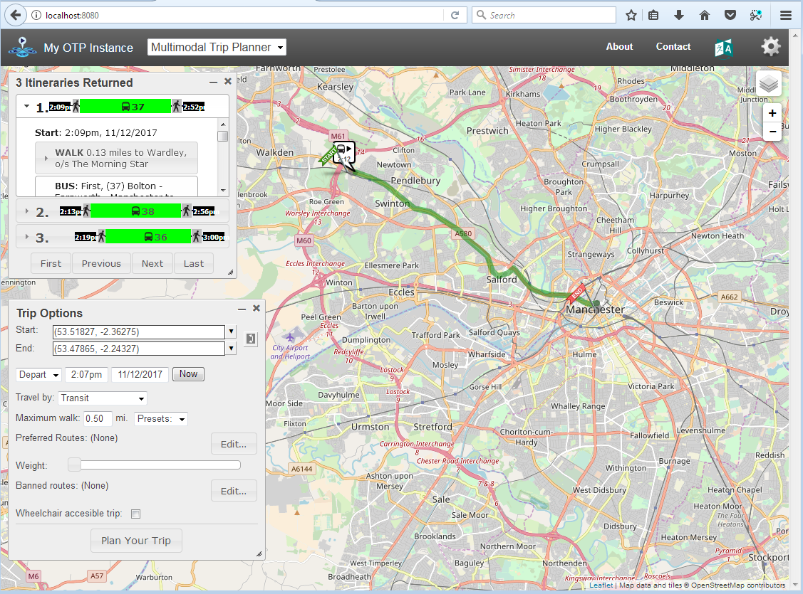
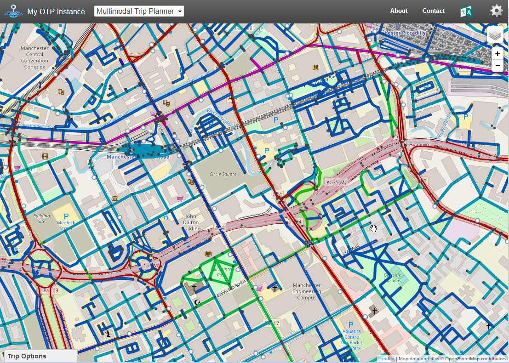
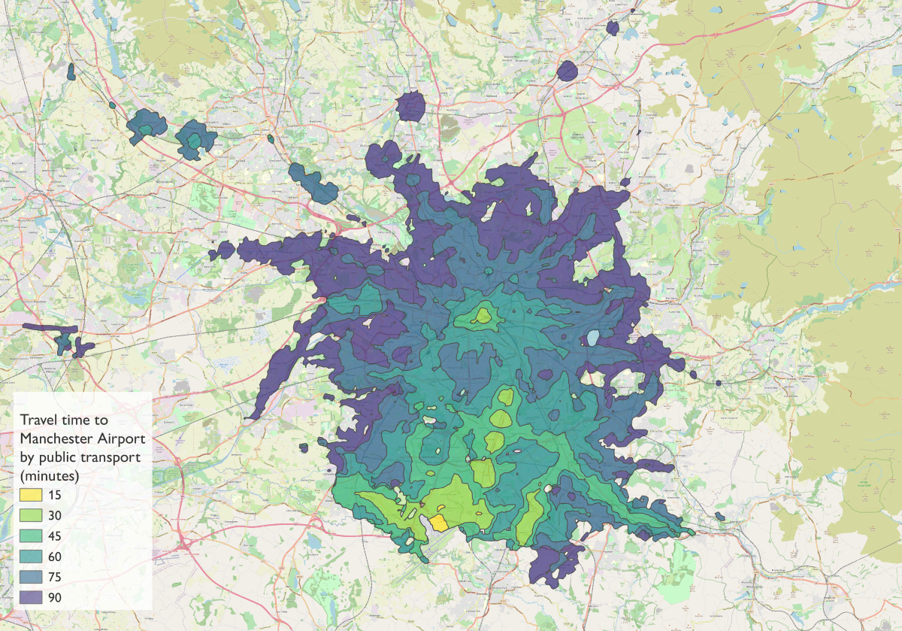
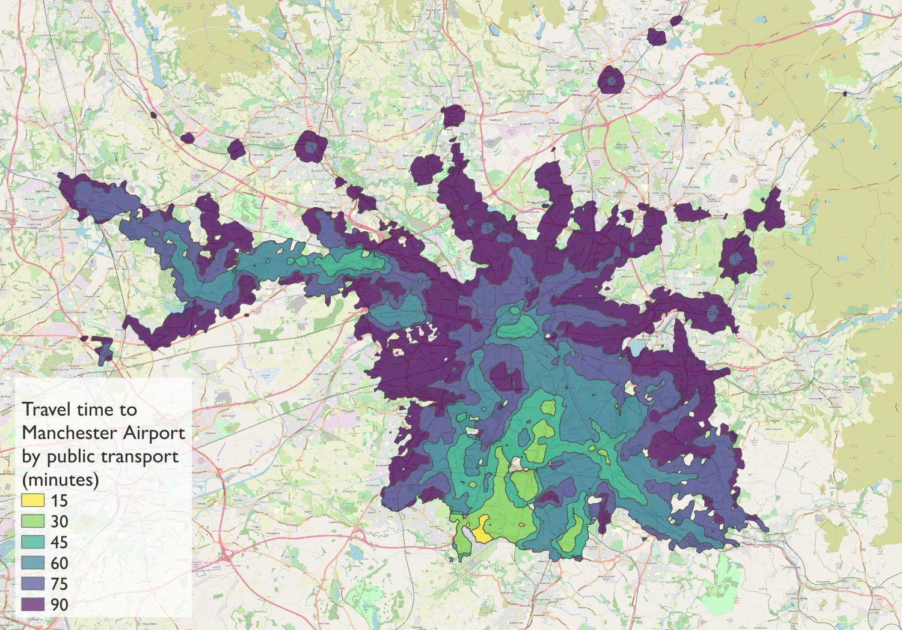
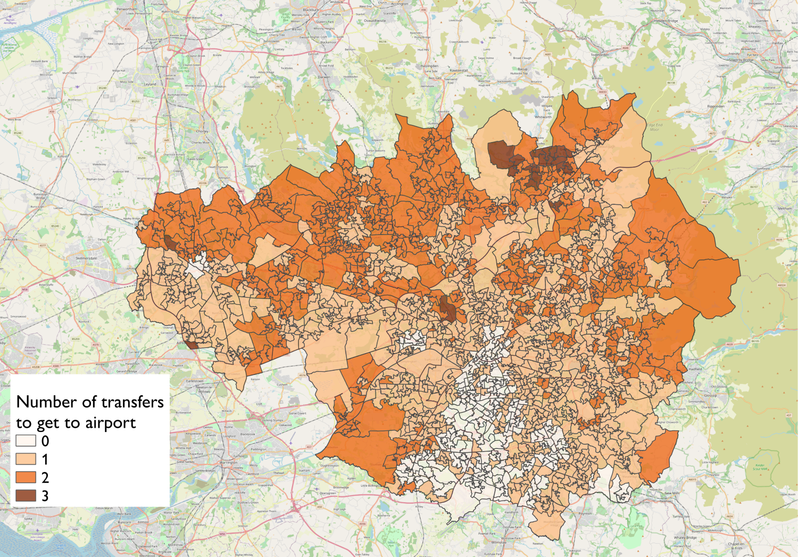

```{r setup, include=FALSE}
knitr::opts_chunk$set(echo = TRUE)
```

## Introduction

This tutorial is an introduction to OpenTripPLanner (OTP) - an open-source and cross-platform multi-modal route planner written in JAVA. It uses imported Open Street Map (OSM) data for routing on the street and path network and supports
multi-agency public transport routing through imported GTFS feeds. It can also apply a digital elevation model to the OSM street network, allowing, for example, cycle-friendly routes to be requested. OTP has a web front-end that can be used by end-users, and a sophisticated routing API.

A major advantage of running your own multi-modal route planner is the ability to carry out analysis using amended transport data. Services such as as Google Maps or TransportAPI are based on curernt public transport schedules and the existing road network. OTP enables you to modify transit schedules and/or make changes to the underlying street network. By editing alocal copy of OSM, you can model the effects of opening new roads, closing roads, or imposing other restrictions. You can also look back in time. For example, you might want to examine the effect of reductions in rural bus services on accessibility to health facilities. To do this you will need a network with bus schedules as they were *x* years ago.

This tutorial consists of three parts:

1. You'll start by building an OTP network graph for the street network and public transport services in Greater Manchester, and then launch your OTP instance and requst routes using the web interface.

2. Next, you'll query the OTP Isochrone API to obtain travel-time polygons, visualising the accessibility of Manchester Airport by public trasport.

3. And finally you'll automate querying the OTP route planner API, looking up route information for each Lower Layer Super Output Area (LSOA) in Greater Manchester.

The tutorial includes  challenges,  hints and  links to extra resources.

## Supporting materials

The datasets and applications used in this tutorial are available from a GitHub repository and can be downloaded in a single zip file: [https://github.com/marcusyoung/otp-tutorial/materials.zip](https://github.com/marcusyoung/otp-tutorial/materials.zip).

Once you have extracted this zip file, you should have the following folders and files:

### /apps ###

* **otp.jar**, the OpenTripPlanner application, in a single runable JAR file. This has been compiled from a modified version of the source code with average road speeds and traversal rules that are more appropriate for the UK.

* **otp-api-fn.R**, a set of R functions that can be used to query the OTP API and process the response.

### /data ###

* **router-config.json**, a configuration for OTP.

* **greater-manchester-osm.pbf**, an extract from OpenStreetMap (OSM) covering the Greater Manchester area, obtained from: [http://download.geofabrik.de/europe/great-britain/england/greater-manchester.html](http://download.geofabrik.de/europe/great-britain/england/greater-manchester.html).

* **rail-gtfs.zip**, a GTFS feed for UK national rail services, limited to operators that provide services in the Greater Manchester area. Based on a full feed (dated 26/06/17) obtained from: [http://transitfeeds.com/p/association-of-train-operating-companies/284](http://transitfeeds.com/p/association-of-train-operating-companies/284).


* **tfgm-gtfs.zip**, a GTFS feed for transit services in Greater Manchester (dated 28/04/17), provided by Transport for Greater Manchester (TfGM) and obtained from: [http://transitfeeds.com/p/transport-for-greater-manchester/224](http://transitfeeds.com/p/transport-for-greater-manchester/224).

* **aircoach-gtfs.zip**, a GTFS feed for a fictional coach link service between Wigan and Manchester Airport.

* **gm-lsoa-polygons.\***, a Shapefile containing polygons for the 1,740 Lower Layer Super Output Areas (LSOA) that cover the Greater Manchester area.

* **gm-lsoa-centroids.csv**, a CSV file containing attributes and centroid coordinates for the Greater Manchester LSOAs. 


### /code

* **part2.R**, R code used in Part 2 of the tutorial

* **part3.R**, R code used in Part 3 of the tutorial


## Part 1 - Setting up and testing an OTP instance (25 mins)


### Building an OTP Graph

An OTP graph specifies every location in the region covered and how to travel between them, and is compiled by OTP using OSM data for the street and path network (used for walk, bicycle and drive modes) and GTFS data for transit scheduling. It can also incorporate a digital terrain model (in GeoTIFF format) which is 'draped' over the street network and can be used in routing - for example to request a flatter cycling route.

Our first task is to create the folder and file structure expected by OTP. This is a base directory called `otp` which contains the OTP JAR file, and a sub-directory called `graphs`. Directories created under `graphs` are known as OTP routers, and contain all the files required to build a graph. A single OTP instance can host several routers - for example covering different regions. 

Create a router called 'current', and include the GTFS and OSM files for the road network and current transit schedules for Greater Manchester, along with `router-config.json`, as shown below:   

```{r, engine = 'bash', eval = FALSE}
/otp
  otp.jar
  /graphs
     /current
         rail-gtfs.zip
         tfgm-gtfs.zip
         greater-manchester-osm.pbf
         router-config.json
```

With the structure created and the files in place, we can now build the graph by running OTP and specifying the `--build` option. OTP runs within a Java virtual machine (JVM), which is provided by the Java run-time environment (JRE). Before continuing, run `java -version` from the command prompt or terminal to check that you have version 1.8 of the JVM installed. If you do not have the correct JRE installed you will need to install it for your operating system from: [http://www.oracle.com/technetwork/java/javase/downloads/jre8-downloads-2133155.html](http://www.oracle.com/technetwork/java/javase/downloads/jre8-downloads-2133155.html])

From the command prompt or terminal, change to the `otp` directory and run the following command:

```{r, engine = 'bash', eval = FALSE}
java -Xmx2G -jar otp.jar --build graphs/current
```

The java option `-Xmx2G` allocates up to 2GB of RAM to the JVM. If you do not have this much free RAM available OTP will likely fail during the build process. The `--build` option tells OTP that we want to build a graph, and `graphs/current` is the path to the router directory (in this case 'current').

The build process should take 2-3 minutes to complete. Don't worry about the errors that flash up during this process These mostly relate to railway stations that are located outside of the Greater Manchester area, where there is no road network to link them to. Once complete, you will see a file called `Graph.obj` in the `current` directory.


### Starting up OTP server

The next step is to start up your OTP server, running the router called `current'. OTP will load the graph you created into memory and you will then be able to plan multi-modal routes using the web interface. From the `otp` directory, run the following command:

```{r, engine = 'bash', eval = FALSE}
java -Xmx2G -jar otp.jar --router current --graphs graphs --server
```

`--router` specifies the name of the router we want to use (this can be repeated if you want a single instance of OTP to run multiple routers); `--graphs` specifies the graph directory (relative to current directory or a full path); and `--server` indicates that we want to launch OTP in server mode (rather than the build mode we used earlier). OTP has a built-in web server called Grizzly which runs on port 8080. If you have another application running on your computer that uses this port then you will need specify an alternative port using the `--port` option, for example:

```{r, engine = 'bash', eval = FALSE}
java -Xmx2G -jar otp.jar --router current --graphs graphs --server --port 8888
```

It should only take a minute or two for OTP to load the graph and start the Grizzly server. If all has worked you should now see the message: `Grizzly server running`. You must leave the command prompt/terminal window open. If you close it, the server will stop running. You can stop the server without closing the window by entering `Ctrl-C`.

You can now access the web interface using the URL: [http://localhost:8080](http://localhost:8080). Note: The web interface does not work correctly in Internet Explorer - use Firefox or Chrome. You can now zoom into the Manchester area and request a route by setting an origin and a destination directly on the map (by right clicking your mouse) and you can specify travel dates, times and modes using the 'Trip Options' window (see Figure \ref{fig:otpgui}). You can change the background map from the layer stack icon at the top right.

```{r, out.width = "11cm", echo=FALSE, fig.align='center', fig.cap="\\label{fig:otpgui}OTP Web GUI"}

```

Congratulations, you now have your own multi-modal router planner!

## Extras (if you have time)

For troubleshooting routing issues, you can visualise the traversal permissions of street edges, the bike safety of edges, and how transit stops are linked to streets. For these additional debug layers to be available, add `?debug_layers=true` to the URL, like this:  [http://localhost:8080?debug_layers=true](http://localhost:8080?debug_layers=true). The extra layers will be listed in the layer stack menu. Figure \ref{fig:otpdebug} shows the Bike Safety layer (green signifies most safe, red the least safe).

 You can read more about the different debug layers in the official OTP documentation: [http://docs.opentripplanner.org/en/latest/Troubleshooting-Routing/#debug-layers](http://docs.opentripplanner.org/en/latest/Troubleshooting-Routing/#debug-layers). 

```{r, out.width = "11cm", echo=FALSE, fig.align='center', fig.cap="\\label{fig:otpdebug}OTP Web GUI with Bike Safety debug layer activated"}

```


## Part 2 - generating travel time isochrones (40 mins)

Now that we have a working instance of OTP, we'll use it to generate some travel-time isochrones. We are interested in visualising how long it takes to access Manchester Airport using public transport from different parts of Greater Manchester. We will do this by requesting isochrones from OTP for 15, 30, 45, 60, 75 and 90 minutes. This can be achieved with a single query to the 'Isochrone' resource of the OTP API.

To send the query to OTP, you could use a web browser and submit a long URL, something like this:

[http://localhost:8080/otp/routers/current/isochrone?fromPlace=53.3627432,-2.2729342&mode=WALK,TRANSIT&date=07-10-2017&time=08:00am&maxWalkDistance=1600&walkReluctance=5&minTransferTime=600&cutoffSec=900&cutoffSec=1800&cutoffSec=2700&cutoffSec=3600&cutoffSec=4500&cutoffSec=100000](http://localhost:8080/otp/routers/current/isochrone?fromPlace=53.3627432,-2.2729342&mode=WALK,TRANSIT&date=07-10-2017&time=08:00am&maxWalkDistance=1600&walkReluctance=5&minTransferTime=600&cutoffSec=900&cutoffSec=1800&cutoffSec=2700&cutoffSec=3600&cutoffSec=4500&cutoffSec=100000)

OTP will then return the isochrone polygons in GeoJSON format, which can be downloaded and imported into a GIS.

A long URL like this will soon get confusing and prone to errors, so we'll use R to construct the URL, submit it to the OTP API, and save the returned GeoJSON. To do this, we can use the `GET()` method from the `httr` package. The code you need is shown below. We provide the `GET()` with the base URL to access the isochrone resource of the router called 'current' and then specify the query parameters to appended to the URL. The code below will submit exactly the same URL as the one shown above, but it's much easier to see the parameters and amend their values:

```{r isochrone_current, eval=FALSE}

library(httr)
airport_current <- GET(
  "http://localhost:8080/otp/routers/current/isochrone",
  query = list(
    fromPlace = "53.3627432,-2.2729342", # latlong of Manchester Airport
    mode = "WALK,TRANSIT", # modes we want the route planner to use
    date = "07-10-2017",
    time= "08:00am",
    maxWalkDistance = 1600, # in metres
    walkReluctance = 5,
    minTransferTime = 600, # in secs (allow 10 minutes)
    cutoffSec = 900,
    cutoffSec = 1800,
    cutoffSec = 2700,
    cutoffSec = 3600,
    cutoffSec = 4500,
    cutoffSec = 5400
  )
)
```

After running the code above, the OTP response will be saved to 'airport_current', and you'll see it in the 'Environment' tab in RStudio. We now need to convert this into text format and save the GeoJSON to a file:

```{r save_geojson, eval=FALSE}

airport_current <- content(airport_current, as = "text", encoding = "UTF-8")

write(airport_current, file = "airport-current.geojson")

```

You can now import the GeoJSON file into QGIS, using the 'Add Vector Layer' tool, and apply a suitable categorized style based on the time attribute. Use the OpenLayers plugin to add a suitable basemap. You should finish up with something similar to Figure \ref{fig:airportcurrent}.

```{r, out.width = "11cm", echo=FALSE, fig.align='center', fig.cap="\\label{fig:airportcurrent}15-90 minute isochrone for Manchester Airport - based on current services", fig.pos='h'}

```


 **The isochrone map indicates poor accessibility by public transport from the Wigan district. You have been asked to assess the impact of an airport link coach running between Wigan and Manchester Airport every ten minutes. You have been provided with a GTFS feed, `aircoach-gtfs.zip`, which contains the information about this service. Create another router called 'new' which incorporates the airport link service. Then request an isochrone from the new router and visualise it using QGIS.**


Hopefully, your new isochrone will look similar to Figure \ref{fig:airportnew}. We can see that the new service has greatly improved accessibility to the airport by public transport from the Wigan district. 


```{r, out.width = "11cm", echo=FALSE, fig.align='center', fig.cap="\\label{fig:airportnew}15-90 minute isochrones for Manchester Airport - with new Wigan Air Coach", fig.pos='h'}

```


## Part 3 - automating OTP API lookups using R (40 mins)

In this final part of the tutorial, we are going to automate querying the OTP API to generate large quantities of route data - potentially for many thousands of origin:destination pairs. In this example, we will gather data on accessing Manchester Airport using public transport for each of the Lower Super Output Areas (LSOAs) in Greater Manchester.

We'll start by importing the CSV file `gm-lsoa-centroids.csv` into an R dataframe using `read.csv()`:

```{r load lsao, eval=TRUE}

# Import the LSOA CSV file
gm_lsoa_centroids <- read.csv("materials/data/gm-lsoa-centroids.csv", stringsAsFactors = FALSE)


```

We next need to load some R functions that can query the Planner resource of the OTP API and parse the XML response. These functions are not yet part of an R package, so we just read the file, `fn_otp_api.R`, using `source()`:

```{r load functions, eval=TRUE, message=FALSE}

# Load the OTP API functions
source("materials/apps/otp-api-fn.R")

```

We are going to use two functions. The first is `otpConnect()`, which defines the OTP instance and router we want to query:     

```{r otpconnect, eval=TRUE}

# Call otpConnect() to define a connection called otpcon
otpcon <-
  otpConnect(
    hostname = "localhost",
    router = "current",
    port = "8080",
    ssl = "false"
  )
```

The second is `otpTripTime()`, which retrieves an itinerary between a specified origin and destination. Try the example below, which uses the first LSOA in `gm_lsoa_centroids`, which has origin coordinates '53.43329,-2.13357':

```{r otptriptime, eval=TRUE}
# Call otpTripTime to get attributes of an itinerary
   otpTripTime(
      otpcon,
      from = '53.43329,-2.13357',
      to =   '53.36274,-2.27293',
      modes = 'TRANSIT,WALK',
      detail = TRUE,
      date = '2017-07-12',
      time = '08:00am',
      maxWalkDistance = '1600',
      walkReluctance = '5',
      minTransferTime = '600'
    )
```

A list is returned. The first item in the list contains the errorId, and the second is a dataframe, containing the start and end date/time, journey duration (minutes), time spent walking, time on public transport, waiting time, and number of transfers.

To obtain and store this information for every LSOA centroid, we can use a R for loop. The code below deals with each row in `gm_lsoa_centroids` in turn. For each LSOA a query is submitted to OTP and the trip attributes returned are stored in separate columns in the `gm_lsoa_centroids` dataframe. As this loop will take a few minutes to complete, a progress indicator is included. This will display in the R console. It requires the `progress` package to be installed and loaded:

```{r loop query api, eval=FALSE}

install.packages("progress")
library(progress)

total <- nrow(gm_lsoa_centroids) # set number of records
pb <- progress_bar$new(total = total, format = "(:spin) [:bar] :percent") #progress bar

# Begin the loop  
for (i in 1:total) {
  pb$tick()   # update progress bar

  response <-
    otpTripTime(
      otpcon,
      from = gm_lsoa_centroids[i, ]$latlong,
      to = '53.36274,-2.27293',
      modes = 'WALK,TRANSIT',
      detail = TRUE,
      date = '2017-07-12',
      time = '08:00am',
      maxWalkDistance <- "1600", # allows 800m at both ends of bus journey
      walkReluctance <- "5",
      minTransferTime <- "600"
    )
  # If response is OK update dataframe
  if (response$errorId == "OK") {
    gm_lsoa_centroids[i, "status"] <- response$errorId
    gm_lsoa_centroids[i, "duration"] <- response$itineraries$duration
    gm_lsoa_centroids[i, "waitingtime"] <- response$itineraries$waitingTime
    gm_lsoa_centroids[i, "transfers"] <-response$itineraries$transfers
  } else {
    # record error
    gm_lsoa_centroids[i, "status"] <- response$errorId
  }
}
```

Once the loop is complete you can view the `gm_lsoa_centroids` dataframe, and see the populated data. Here are the first few rows:


```{r, engine = 'bash', eval = FALSE}
       code easting northing           latlong status duration waitingtime transfers
1 E01005756  391223   392954 53.43329,-2.13357     OK    44.20        0.03         1
2 E01005757  390660   391186 53.41739,-2.14199     OK    35.28        0.03         1
3 E01005754  390870   392662 53.43066,-2.13888     OK    47.23        0.03         1
4 E01005755  391140   391965 53.42440,-2.13479     OK    34.23        0.03         1
```


 **Export the dataframe `gm_lsoa_centroids` to a CSV file and load it into QGIS. A shapefile for the LSOA polygons is provided in the data folder. Join the route data from the LSOA centroids to the polygon shapefile. Explore how duration, waiting time and transfers vary across the LSOAs.**

 *You can use use `write.csv()` to export from R and the 'add delimited text layer' tool to import into QGIS (using eastings and northings as coordinates). Joins are configured in the properties of the polygon layer, in the Joins tab.*

You should end up with something similar to Figure \ref{fig:lsoa-transfers}.

```{r, out.width = "11cm", echo=FALSE, fig.align='center', fig.cap="\\label{fig:lsoa-transfers}Number of transfers required to get to Manchester Airport by public transport, for each LSOA", fig.pos='h'}

```

## Additional resources

* The official project documentation for OTP: [http://docs.opentripplanner.org/en/latest/](http://docs.opentripplanner.org/en/latest/)
* The OTP project on GITHUB: [https://github.com/opentripplanner/OpenTripPlanner](https://github.com/opentripplanner/OpenTripPlanner)
* OTP API documentation for Planner resource: [http://dev.opentripplanner.org/apidoc/1.0.0/resource_PlannerResource.html](http://dev.opentripplanner.org/apidoc/1.0.0/resource_PlannerResource.html)
* onebusaway-gtfs-transformer-cli - a useful command-line application for transforming GTFS feeds: [http://developer.onebusaway.org/modules/onebusaway-gtfs-modules/1.3.3/onebusaway-gtfs-transformer-cli.html](http://developer.onebusaway.org/modules/onebusaway-gtfs-modules/1.3.3/onebusaway-gtfs-transformer-cli.html)
* JOSM - application for editing local copies of OSM data: [https://josm.openstreetmap.de/](https://josm.openstreetmap.de/).