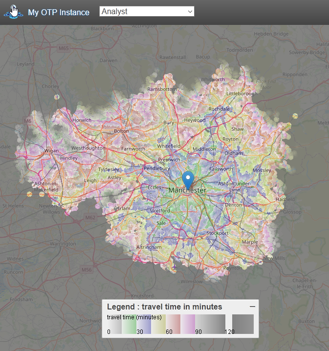
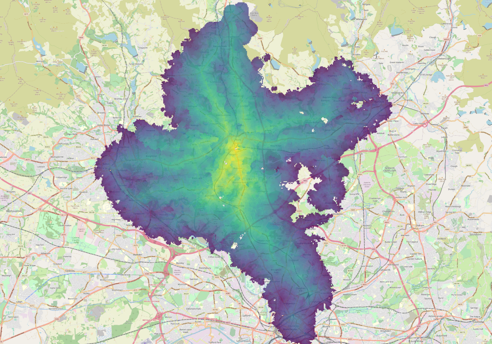

```{r setup, include=FALSE}
knitr::opts_chunk$set(echo = TRUE, tidy.opts=list(width.cutoff=60),tidy=TRUE)
```


## Introduction

This tutorial is an introduction to OpenTripPlanner (OTP) - an open-source and cross-platform multi-modal route planner written in JAVA. It uses imported Open Street Map (OSM) data for routing on the street and path network and supports multi-agency public transport routing through imported GTFS feeds. It can also apply a digital elevation model to the OSM street network, allowing, for example, cycle-friendly routes to be requested. OTP has a web front-end that can be used by end-users, and a sophisticated routing API.

A major advantage of running your own multi-modal route planner is the ability to carry out analysis using amended transport data. Services such as as Google Maps, TravelTime and TransportAPI are based on current public transport schedules and the existing road network. OTP enables you to modify transit schedules and/or make changes to the underlying street network. By editing a local copy of OSM, you can model the effects of opening new roads, closing roads, or imposing other restrictions. You can also look back in time. For example, you might want to examine the effect of reductions in rural bus services on accessibility of health facilities. To do this you would need a network with bus schedules as they were in previous years.

This tutorial is based on version 1.5 of OTP (for information about OTP version 2, see: [Using OTPv2](#otpv2)) and consists of four parts:

1. You'll start by building an OTP network graph for the street network and public transport services in Greater Manchester, and then launch your OTP instance and request routes using the web interface.

2. Next, you'll query the OTP Isochrone API to obtain travel-time polygons, visualising the accessibility of Manchester Airport by public transport.

3. You'll then automate querying the OTP route planner API using the otpr R package, looking up route information for each Lower Layer Super Output Area (LSOA) in Greater Manchester.

4. And finally, you'll use the OTP surface analysis API to perform efficient one-to-many analysis and measure the number of jobs accessible from an LSOA.

To complete the tutorial you will need access to QGIS, RStudio and Firefox or Chrome web browser. The tutorial contains several  challenges, along with  tips and  links to extra resources. It should take about three hours to complete.

## Supporting materials

The datasets and applications used in this tutorial are available from a GitHub repository and can be downloaded in a single zip file called `materials.zip`, from here: [https://github.com/marcusyoung/otp-tutorial](https://github.com/marcusyoung/otp-tutorial).

Once you have extracted this zip file, you should have the folders and files listed below. **Note**: the GTFS ZIP files must not be extracted.

### /apps ###

* **otp.jar**, the OTP application, in a single runnable JAR file. This has been compiled from a modified version of the source code (based on v1.4) that includes a UK Way Property Set.

### /data ###

* **build-config.json**, a configuration file for OTP (specifies that OTP should use the UK Way Property Set which sets road speeds and traversal permissions suitable for the UK)

* **router-config.json**, a configuration file for OTP (sets left hand drive).

* **greater-manchester-osm.pbf**, an extract from OSM covering the Greater Manchester area, obtained from: [http://download.geofabrik.de/europe/great-britain/england/greater-manchester.html](http://download.geofabrik.de/europe/great-britain/england/greater-manchester.html).

* **rail-gtfs.zip**, a GTFS feed for UK national rail services, limited to operators that provide services in the Greater Manchester area.

* **tfgm-gtfs.zip**, a GTFS feed for transit services in Greater Manchester, provided by Transport for Greater Manchester (TfGM) and obtained from: [https://openmobilitydata.org/p/transport-for-greater-manchester/224](https://openmobilitydata.org/p/transport-for-greater-manchester/224).

* **aircoach-gtfs.zip**, a GTFS feed for a fictional coach link service between Wigan and Manchester Airport.

* **gm-lsoa-polygons.\***, a Shapefile containing polygons for the 1,740 LSOAs that cover the Greater Manchester area.

* **gm-lsoa-centroids.csv**, a CSV file containing attributes and centroid coordinates for the Greater Manchester LSOAs. 

* **gm-wz.csv**, a CSV file containing a row for each census workplace zone within Greater Manchester. The zone ID, centroid coordinates of each zone and the number of jobs assigned to each zone are provided.

* **gm-jobs.csv**, the same as above, but without the zone ID column.


### /code

* **part2.R**, R code used in Part 2 of the tutorial

* **part3.R**, R code used in Part 3 of the tutorial

* **part4.R**, R code used in Part 4 of the tutorial


## Part 1 - Setting up and testing an OTP instance (30 mins)


### Building an OTP Graph

An OTP graph specifies every location in the region covered and how to travel between them, and is compiled by OTP using OSM data for the street and path network (used for walk, bicycle and drive modes) and GTFS data for transit scheduling.

Our first task is to create the folder and file structure expected by OTP. Start by creating a base directory called `otp`. Copy the OTP JAR file to this directory from the extracted ZIP file. Next create a sub-directory called `graphs`. Directories created under `graphs` are known as OTP routers, and contain all the files required to build a graph. A single OTP instance can host several routers, for example covering different regions. Create a router called 'current', and copy over the GTFS and OSM files for the road network and current transit schedules for Greater Manchester, along with `build-config.json` and `router-config.json`, as shown below:   

```{r, engine = 'bash', eval = FALSE}
/otp
  otp.jar
  /graphs
     /current
         gm-rail-gtfs.zip
         tfgm-gtfs.zip
         gm.osm.pbf
         build-config.json
         router-config.json
```

`router-config.json` is actually read when the OTP server is started, but we add it now for convenience.

OTP runs within a Java virtual machine (JVM), which is provided by the Java run-time environment (JRE). Before continuing, run `java -version` from the command prompt or terminal to check that you have a 1.8 version of the JVM installed (the specific sub-version doesn't matter). If you do not have the correct JRE installed you will need to install it for your operating system from: [https://www.oracle.com/java/technologies/javase-jre8-downloads.html](https://www.oracle.com/java/technologies/javase-jre8-downloads.html).

With the structure created and the files in place, we can now build the graph by running OTP and specifying the `--build` option. From the command prompt or terminal, change to the `otp` directory and run the following command:

```{r, engine = 'bash', eval = FALSE}
java -Xmx2G -jar otp.jar --build graphs/current
```

The java option `-Xmx2G` allocates up to 2GB of RAM to the JVM. You can set this to a higher value if you have more free RAM available. If you do not have this much free RAM available OTP will likely fail during the build process. You can set this to a higher value if you have more free RAM available. The `--build` option tells OTP that we want to build a graph, and `graphs/current` is the path to the router directory (in this case 'current').

The build process should take up to 5 minutes to complete. Don't worry about the errors that flash up during this process. These mostly relate to transit stops within the TfGM GTFS feed that are located outside of the Greater Manchester area, where there is no road network to link them to. Once complete, you should see a file called `Graph.obj` in the `current` directory.


### Starting up OTP server

The next step is to start up your OTP server, running the router called 'current'. OTP will load the graph you created into memory and you will then be able to plan multi-modal routes using the web interface. From the `otp` directory, run the following command:

```{r, engine = 'bash', eval = FALSE}
java -Xmx2G -jar otp.jar --router current --graphs graphs --server
```

`--router` specifies the name of the router we want to use (this can be repeated if you want a single instance of OTP to run multiple routers); `--graphs` specifies the graph directory (relative to current directory or a full path); and `--server` indicates that we want to launch OTP in server mode (rather than the build mode we used earlier). OTP has a built-in web server called Grizzly which runs on port 8080 (http) and 8081 (https). If you have another application running on your computer that uses these ports then you will need to specify alternative ports using the `--port` and `--securePort` options, for example:

```{r, engine = 'bash', eval = FALSE}
java -Xmx2G -jar otp.jar --router current --graphs graphs --server --port 8801 
--securePort 8802
```

It should only take a minute or two for OTP to load the graph and start the Grizzly server. If all has worked you should see the message: `Grizzly server running`. You must leave the command prompt/terminal window open. If you close it, the server will stop running. You can stop the server without closing the window by entering `Ctrl-C`.

You can now access the web interface using the URL: [http://localhost:8080](http://localhost:8080). **Note:** The web interface does not work correctly in Internet Explorer - use Firefox or Chrome. You can now zoom into the Manchester area and request a route by setting an origin and a destination directly on the map (by right clicking your mouse) and you can specify travel dates, times and modes using the 'Trip Options' window (see Figure \ref{fig:otpgui}).

```{r, out.width = "10cm", echo=FALSE, fig.align='center', fig.cap="\\label{fig:otpgui}OTP Web GUI"}
knitr::include_graphics("images/otpwebgui.png")
```

You can change the background map from the layer stack icon at the top right. Try changing it to OSM. If you zoom into the map the transit stops will become visible as small white circles with a grey border. If you click on these a pop-up will show information about the stop and the routes serving it.

Congratulations, you now have your own multi-modal router planner!

### Extras (if you have time)

For troubleshooting routing issues, you can visualise the traversal permissions of street edges, the bike safety of edges, and how transit stops are linked to streets. For these additional debug layers to be available, add `?debug_layers=true` to the URL, like this:  [http://localhost:8080?debug_layers=true](http://localhost:8080?debug_layers=true). The extra layers will be listed in the layer stack menu. Figure \ref{fig:otpdebug} shows the Bike Safety layer (green signifies most safe, red the least safe). If you zoom in to the street edges you'll see the cost weightings that are applied.

 *You can read more about the different debug layers in the official OTP documentation: [http://http://docs.opentripplanner.org/en/v1.5.0/Troubleshooting-Routing/#debug-layers](http://docs.opentripplanner.org/en/v1.5.0/Troubleshooting-Routing/#debug-layers).* 

```{r, out.width = "10cm", echo=FALSE, fig.align='center', fig.cap="\\label{fig:otpdebug}OTP Web GUI with Bike Safety debug layer activated"}
knitr::include_graphics("images/otpdebug.png")
```


## Part 2 - Generating travel time isochrones (50 mins)

Now that we have a working instance of OTP, we'll use it to generate some travel-time isochrones. We are interested in visualising how long it takes to access Manchester Airport using public transport from different parts of Greater Manchester. We will do this by requesting isochrones from OTP for 15, 30, 45, 60, 75 and 90 minutes. This can be achieved with a single query to the 'Isochrone' resource of the OTP API.

[http://localhost:8080/otp/routers/current/isochrone?toPlace=53.3627432,-2.2729342&fromPlace=53.3627432,-2.2729342&arriveBy=TRUE&mode=WALK,TRANSIT&date=04-28-2020&time=08:00am&maxWalkDistance=1600&walkReluctance=5&minTransferTime=600&cutoffSec=900&cutoffSec=1800&cutoffSec=2700&cutoffSec=3600&cutoffSec=4500&cutoffSec=5400](http://localhost:8080/otp/routers/current/isochrone?toPlace=53.3627432,-2.2729342&fromPlace=53.3627432,-2.2729342&arriveBy=TRUE&mode=WALK,TRANSIT&date=04-28-2020&time=08:00am&maxWalkDistance=1600&walkReluctance=5&minTransferTime=600&cutoffSec=900&cutoffSec=1800&cutoffSec=2700&cutoffSec=3600&cutoffSec=4500&cutoffSec=5400)

OTP will then return the isochrone polygons. Depending on the browser you are using (and how it makes the request) the polygons will be returned in either GeoJSON format or as a zipped shapefile, which can then be downloaded and imported into a GIS.

A long URL like this will soon get confusing and prone to errors, so instead we'll use R to construct the URL, submit it to the OTP API, and save the returned GeoJSON.

We will now use the `GET()` method from the `httr` package. The code you need is shown below. We provide `GET()` with the base URL to access the isochrone resource of the router called 'current' and specify the query parameters to append to the URL. This code will submit exactly the same URL as the one shown above, but it's much easier to see the parameters and amend their values:

```{r isochrone_current, eval=FALSE, tidy = F}

library(httr)
airport_current <- GET(
  "http://localhost:8080/otp/routers/current/isochrone",
  query = list(
    toPlace = "53.3627432,-2.2729342", # latlong of Manchester Airport
    fromPlace = "53.3627432,-2.2729342", # latlong of Manchester Airport
    arriveBy = TRUE,
    mode = "WALK,TRANSIT", # modes we want the route planner to use
    date = "01-19-2021",
    time= "08:00am",
    maxWalkDistance = 1600, # in metres
    walkReluctance = 5,
    minTransferTime = 600, # in secs (allow 10 minutes)
    cutoffSec = 900,
    cutoffSec = 1800,
    cutoffSec = 2700,
    cutoffSec = 3600,
    cutoffSec = 4500,
    cutoffSec = 5400
  )
)
```

You will notice that both `toPlace` and `fromPlace` parameters are set in this example. This is due to a bug in OTP. The `toPlace` and `fromPlace` parameters control the direction of the isochrone, whether it is towards or away from the location. If `fromPlace` is provided then we are requesting an isochrone that is away from the location (where can we reach *from* the location within the specified cutoff). If `toPlace` is provided then we are requesting an isochrone that is towards the location (from where can we get *to* the location within the specified cutoff). Due to a bug in OTP, if you require an isochrone that is towards the location you still need to provide the `fromPlace` parameter (it will be ignored if `toPlace` is also provided). To avoid confusion, you may want to set it the same as `toPlace`. Also, if requesting an isochrone towards the location you may want to set `arriveBy = TRUE`, to indicate that the `time` parameter is the desired arrival time at the location (you can still leave this at the default of `FALSE` if you want `time` to represent the desired departure time).

After running the code above, the OTP response will be saved to `airport_current`, and you'll see it in the 'Environment' tab in RStudio. We now need to convert this into text format and then save the GeoJSON to a file:

```{r save_geojson, eval=FALSE}

airport_current <- content(airport_current, as = "text", encoding = "UTF-8") # to text

write(airport_current, file = "airport-current.geojson") # save to file

```

 *You can also use the otpr R package to generate isochrones using the `otp_get_isochrone()` function. The otpr package is introduced in Part 3 of the tutorial.*

You can now import the GeoJSON file into QGIS, using the 'Add Vector Layer' tool, and apply a suitable categorized style based on the time attribute. Use the OpenLayers plugin to add a suitable basemap. You should finish up with something similar to Figure \ref{fig:airportcurrent}.

```{r, out.width = "10cm", echo=FALSE, fig.align='center', fig.cap="\\label{fig:airportcurrent}15-90 minute isochrone for Manchester Airport - based on current services", fig.pos='h'}
knitr::include_graphics("images/airport-isochrone-current.png")
```


 **The isochrone map indicates poor accessibility by public transport from the Wigan district. You have been asked to assess the impact of an airport link coach running between Wigan and Manchester Airport every ten minutes. You have been provided with a GTFS feed, `aircoach-gtfs.zip`, which contains the information about this service. Create another OTP router called 'new' which incorporates the airport link service. Then request an isochrone from the new router and visualise it using QGIS.**


Hopefully, your new isochrone will look similar to Figure \ref{fig:airportnew}. We can see that the new service has greatly improved accessibility to the airport by public transport from the Wigan district. 


```{r, out.width = "10cm", echo=FALSE, fig.align='center', fig.cap="\\label{fig:airportnew}15-90 minute isochrones for Manchester Airport - with new Wigan Air Coach", fig.pos='h'}
knitr::include_graphics("images/airport-isochrone-new.png")
```


## Part 3 - Automating OTP API lookups using R (50 mins)

In this part of the tutorial, we are going to automate querying the OTP API to generate large quantities of route data - potentially for many thousands of origin:destination pairs. In this example, we will gather data on accessing Manchester Airport using public transport for each of the LSOAs in Greater Manchester.

We'll start by importing the CSV file `gm-lsoa-centroids.csv` into an R dataframe using `read.csv()`:

```{r load lsao, eval=FALSE}

# Import the LSOA CSV file
gm_lsoa_centroids <- read.csv("materials/data/gm-lsoa-centroids.csv",
                              stringsAsFactors = FALSE)


```

Use the `head()` function to take a look at the first few rows:

```{r head lsao, eval=FALSE, echo=TRUE}

head(gm_lsoa_centroids)

```

```{r, engine = 'bash', eval = FALSE}

       code           name easting northing latitude longitude
1 E01005756 Stockport 004D  391223   392954 53.43329  -2.13357
2 E01005757 Stockport 014A  390660   391186 53.41739  -2.14199
3 E01005754 Stockport 004B  390870   392662 53.43066  -2.13888
4 E01005755 Stockport 004C  391140   391965 53.42440  -2.13479
5 E01005752 Stockport 012A  393251   391229 53.41782  -2.10300
6 E01005753 Stockport 004A  391339   392429 53.42858  -2.13181

```

In addition to the LSOA centroid coordinates in Eastings and Northings (British National Grid), they are also provided in latitude and longitude (as required by OTP).

We next need to install and load an R package called otpr that can query the planner resource of the OTP API and parse the XML response:

```{r load functions, eval=FALSE, message=FALSE}

# Install the otpr package
install.packages("otpr")

# Now load the package
library(otpr)

```

 *You can find out more about the otpr package at its GitHub repository: [https://github.com/marcusyoung/otpr](https://github.com/marcusyoung/otpr).* 

We are going to use two functions from the package. The first is `otp_connect()`, which defines the OTP instance and router we want to query:     

```{r otpconnect, eval=FALSE}

# Call otp_connect() to define a connection called otpcon
otpcon <-
  otp_connect(
    hostname = "localhost",
    router = "current",
    port = 8080,
    ssl = FALSE
  )

# As most of the default values of the function arguments are fine for us, we
# could also use: otpcon <- otp_connect(router = "current")

```

If your OTP instance is running then you should get confirmation that the router "current" exists, as shown below:

```{r, engine = 'bash', eval = FALSE}

http://localhost:8080/otp is running OTPv1
Router http://localhost:8080/otp/routers/current exists

```

The second function we'll use is `otp_get_times()`, which retrieves an itinerary between a specified origin and destination. Try the example below, which uses the first LSOA in `gm_lsoa_centroids`, which has origin coordinates c(53.43329,-2.13357):

```{r otp_get_times, eval=FALSE, tidy = F}
# Call otp_get_times to get attributes of an itinerary
   otp_get_times(
      otpcon,
      fromPlace = c(53.43329,-2.13357),
      toPlace =   c(53.36274,-2.27293),
      mode = 'TRANSIT',
      detail = TRUE,
      date = '01-19-2021',
      time = '08:00:00',
      maxWalkDistance = 1600, # allows nominal 800m at both ends of journey
      walkReluctance = 5,
      minTransferTime = 600 # allows at least 10 minutes (600 seconds) for transfers
    )
```

```{r, engine = 'bash', eval = FALSE}
$errorId
[1] "OK"

$itineraries
                start                 end       timeZone  duration walkTime
1 2021-01-19 08:15:49 2021-01-19 09:12:20  Europe/London     56.52     9.45    
   transitTime  waitingTime  transfers
1        34.57         12.5          1
  
$query
[1] "http://localhost:8080/otp/routers/current/plan?fromPlace=53.43329,-2.13357&
toPlace=53.36274,-2.27293&mode=TRANSIT,WALK&date=01-19-2021&time=08:00:00&
maxWalkDistance=1600&walkReluctance=5&waitReluctance=1&arriveBy=FALSE&
transferPenalty=0&minTransferTime=600"

```

A list is returned. The first item in the list contains the errorId; the second is a dataframe containing the start and end date/time, journey duration (minutes), time spent walking, time on public transport, waiting time, and number of transfers; and the third is the URL of the API query that was actually submitted to OTP.

 *You can also request more than one itinerary and get the details about each leg of the trip. To find more about the function enter `?otp_get_times` in the RStudio console.*

To obtain and store this information for every LSOA centroid, we can use an R loop. The code below deals with each row in `gm_lsoa_centroids` in turn. For each LSOA a query is submitted to OTP and the trip attributes returned are stored in separate columns in the `gm_lsoa_centroids` dataframe. As this loop will take a few minutes to complete, a progress indicator is included. This will display in the R console, and requires the `progress` package to be installed and loaded.

```{r loop query api, eval=FALSE}

install.packages("progress")
library(progress)

total <- nrow(gm_lsoa_centroids) # set number of records
pb <- progress_bar$new(total = total, format = "(:spin)[:bar]:percent") #progress bar

# Begin the loop  
for (i in 1:total) {
  pb$tick()   # update progress bar
  response <-
    otp_get_times(
      otpcon,
      fromPlace = c(gm_lsoa_centroids[i, ]$latitude, gm_lsoa_centroids[i, ]$longitude),
      toPlace =  c(53.36274,-2.27293),
      mode = 'TRANSIT',
      detail = TRUE,
      date = '01-19-2021',
      time = '08:00:00',
      maxWalkDistance = 1600,
      walkReluctance = 5,
      minTransferTime = 600
    )
  # If response is OK update dataframe
  if (response$errorId == "OK") {
    gm_lsoa_centroids[i, "status"] <- response$errorId
    gm_lsoa_centroids[i, "duration"] <- response$itineraries$duration
    gm_lsoa_centroids[i, "waitingtime"] <- response$itineraries$waitingTime
    gm_lsoa_centroids[i, "transfers"] <-response$itineraries$transfers
  } else {
    # record error
    gm_lsoa_centroids[i, "status"] <- response$errorId
  }
}
```

Once the loop is complete you can view the `gm_lsoa_centroids` dataframe, and see the populated data. Here are the first few rows (name column removed for clarity):


```{r, engine = 'bash', eval = FALSE}
       code  easting  northing latitude longitude status duration waitingtime transfers
1 E01005756  391223   392954   53.43329 -2.13357  OK     45.90    10.03       1
2 E01005757  390660   391186   53.41739 -2.14199  OK     55.35    23.03       1
3 E01005754  390870   392662   53.43066 -2.13888  OK     51.87    10.03       1
4 E01005755  391140   391965   53.4244  -2.13479  OK     45.63    15.03       1

```


 **Export the dataframe `gm_lsoa_centroids` to a CSV file and load it into QGIS. A shapefile for the LSOA polygons is provided in the data folder. Join the route data from the LSOA centroids to the polygon layer. Explore how duration, waiting time and transfers vary across the LSOAs. You should end up with something similar to Figure \ref{fig:lsoa-transfers}.**

 *You can use `write.csv()` to export from R and the 'add delimited text layer' tool to import into QGIS (using eastings and northings as coordinates). Joins are configured in the properties of the polygon layer, in the Joins tab.*

```{r, out.width = "10cm", echo=FALSE, fig.align='center', fig.cap="\\label{fig:lsoa-transfers}Number of transfers required to get to Manchester Airport by public transport, for each LSOA", fig.pos='h'}
knitr::include_graphics("images/lsoa-transfers.png")
```

## Part 4 - Using surface analysis to perform one-to-many calculations (50 mins)

The OTP surface analysis feature enables you to calculate the travel time from a single origin to thousands of destinations in about the same time that it takes to perform a single origin to destination lookup. This is achieved by generating a surface which contains the travel time to every geographic coordinate that can be reached from an origin.  

### Starting OTP in analysis mode

Before we can use the surface analysis features of OTP, we have to start an OTP server using additional command line arguments. We also need to provide OTP with a CSV file containing information about the destinations (in OTP terminology this file is known as a *pointset*). 

Before continuing, end any current instances of OTP that are running. You can do this by either closing the command prompt/terminal window or by entering the Ctrl+C key sequence.

Now create a new directory called `pointsets` within your `/otp` folder. In the `data` folder that you extracted from `materials.zip` at the beginning of the tutorial, you will find a file called `gm-jobs.csv`. This is a pointset file containing the coordinates of each workplace zone in Greater Manchester (a total of 2534) and the number of jobs within each zone. Copy this file to the new `pointsets` folder.

Now, from the `otp` directory, run the following command to launch an OTP instance in surface analysis mode:

```{r, engine = 'bash', eval = FALSE}
java -Xmx4G -jar otp.jar --router current --graphs graphs --server --analyst
--pointSets pointsets
```

`--analyst` specifies that we want this instance of OTP to make the surface analysis API endpoint available for querying; `--pointSets` specifies the name and location of the pointsets directory (relative to the current directory or a full path). OTP should launch just as you've seen before. Notice that we have allocated more memory to OTP than previously. Surfaces are stored by OTP in RAM, so we need to make more RAM available to the JVM.

 *A pointset file must have two columns named 'lat' (or 'latitude') and 'lon' (or 'longitude') which hold the coordinates of each destination. There must also be at least one numeric opportunity column. This can be named what you like. If you just want to retrieve the time from the origin to each destination you can enter the value 1 in this column for every row. If you want OTP to calculate accessibility measures than this column should contain the number of opportunities available at each destination. For example, if the destinations were workplace zones then this column would have the number of jobs assigned to each zone. You can include more than one opportunity column. For example, if the destinations were census output areas you might have the number of supermarkets in each output area as one opportunity column, and the number of pharmacies as another. You can also have multiple pointset files.* 

Access the web interface using the URL: [http://localhost:8080](http://localhost:8080). In the top left, click on the drop down box and change the value from 'Multimodal Trip Planner' to 'Analyst'. Now move the blue marker and drop it on the centre of Manchester. In a few seconds a surface will be displayed showing the travel time (based on the travel options set) from the origin to every location in the graph (up to a maximum of 120 minutes travel time). It should look similar to Figure \ref{fig:otpanalyst}).

```{r, out.width = "10cm", echo=FALSE, fig.align='center', fig.cap="\\label{fig:otpanalyst}OTP Web Analyst showing travel time surface"}

```

 **Try creating surfaces for different modes and compare them. You will need to change the travel options and then move the blue marker and drop it back on the same location to initiate the generation of the surface. Don't create too many as they take up RAM and OTP will crash if all the RAM allocated to the JVM is utilised.**

### Creating a surface using the API

We are now going to use the `otp_create_surface()` function in the otpr package to create a surface for an LSOA in the centre of Bury (a town in Greater Manchester). We will also save the surface as a GeoTIFF file so that it can be viewed in QGIS. You'll notice that the arguments passed to `otp_create_surface()` are very similar to those used with `otp_get_times()`. It takes a while for the first surface raster file to be generated and saved by a newly started OTP instance. Subsequent rasters will be generated much more quickly.

```{r otp_create_surface, eval=FALSE, tidy = F}
# Call otp_create_surface() to generate a surface
    otp_create_surface(
      otpcon,
      fromPlace = c(53.58746,-2.29979), # coordinate of LSOA E01005027
      date = '01-19-2021',
      time = '08:00:00',
      mode = "TRANSIT",
      maxWalkDistance = 1600, # in metres
      walkReluctance = 5,
      minTransferTime = 600, # in secs (allow 10 minutes)
      getRaster = TRUE, # should be set to FALSE if a GeoTIFF file is not needed
      rasterPath = "C:/temp" # change this as required
    )
```

```{r, engine = 'bash', eval = FALSE}
$errorId
[1] "OK"

$surfaceId
[1] 0

$surfaceRecord
[1] "{\"id\":0,\"params\":{\"mode\":\"TRANSIT,WALK\",\"date\":\"01-19-2021\",
\"walkReluctance\":\"5\",\"arriveBy\":\"FALSE\",\"minTransferTime\":\"600\",
\"fromPlace\":\"53.58746,-2.29979\",\"batch\":\"TRUE\",\"transferPenalty\":\"0
\",\"time\":\"08:00:00\",\"maxWalkDistance\":\"1600\",\"waitReluctance\":\"1\"}}"

$rasterDownload
[1] "C:/temp/surface_0.tiff"

$query
[1] "http://localhost:8080/otp/surfaces?fromPlace=53.58746,-2.29979&
mode=TRANSIT,WALK&date=01-19-2021&time=08:00:00&maxWalkDistance=1600&
walkReluctance=5&waitReluctance=1&transferPenalty=0&minTransferTime=600&
arriveBy=FALSE&batch=TRUE"

```

A list of five elements is returned: the errorId; the ID number that the surface has been allocated by OTP (this will vary depending on how many surfaces you created earlier using the web interface); details of the parameters used to generate the surface; the location of the downloaded raster file; and the URL of the API query that was submitted to OTP.

You can now open the saved surface in QGIS using 'Add raster layer' and set the symbology by changing the render type to 'singleband pseudocolor' and choosing a suitable color ramp. Set the maximum value to 60 (i.e. 60 minutes) and check the box next to 'Clip out of range values'. Your surface should now look similar to Figure \ref{fig:bury-surface}).

```{r, out.width = "10cm", echo=FALSE, fig.align='center', fig.cap="\\label{fig:bury-surface}OTP generated surface from LSOA E01005027 showing travel time up to 60 minutes."}

```

 *The maximum extent of a surface is 120 minutes; this is a hard-coded cutoff within OTP. Every grid cell within the extent of the graph that is 120 minutes travel time or beyond, or not accessible, is given the value of 120. Any grid cell outside of the extent of the network (i.e. unreachable) is given the value 128. Note that the creation of a surface does not make any use of the pointset file. This is only used when a surface is evaluated.*

### Evaluating a surface

Having created a surface, we can now evaluate it. We want to know the number of jobs within Greater Manchester that can be reached within 60 minutes by public transport from the Bury LSOA (E01005027). As we've already created the surface for this LSOA, we can now use the otpr function `otp_evaluate_surface()` to get the answer.

```{r otp_evaluate_surface, eval=FALSE, tidy = F}
# Call otp_evaluate_surface()
    bury_lsoa <- otp_evaluate_surface(otpcon,
      surfaceId = 0, # the ID returned by otp_generate_surface()
      pointset = "gm-jobs", # the name of the pointset file to use (without extension)
      detail = TRUE # return travel times also
    )
```

A list is returned which we've saved as 'bury_lsoa'. This list contains two dataframes, called `jobs` and `times`. Let's take a look at the first ten rows of the `jobs` dataframe:

```{r head jobs, eval=FALSE, echo=TRUE}

head(bury_lsoa$jobs, 10)

```

```{r, engine = 'bash', eval = FALSE}

1        1      0    0       0
2        2      0    0       0
3        3      0    2       2
4        4      0   18      20
5        5      0  112     132
6        6      1  398     530
7        7      1  712    1242
8        8      3  972    2214
9        9      2 1194    3408
10      10      3 1199    4607

```

The `jobs` dataframe has four columns:

* `minutes` The time from the surface origin in one-minute increments (up to 120 minutes).
* `counts` The number of the opportunity locations reached within each minute interval.
* `sum` The sum of the opportunities at each of the locations reached within each minute interval.
* `cumsums` A cumulative sum of the opportunities reached.

To find the number of jobs that are accessible within 60 minutes by transit, we just need to get the cummulative sum at 60 minutes:

```{r cumsum, eval=FALSE, echo=TRUE}

bury_lsoa$jobs$cumsums[60]

```

```{r, engine = 'bash', eval = FALSE}

[1] 300228 # number of jobs reachable in 60 minutes from LSOA E01005027

```

 *The `jobs` dataframe's name was taken by OTP from the name of the opportunity column in the `gm-jobs.csv` pointset file. If you have additional opportunity columns in the pointset file they will be returned as additional dataframes.*

Let's now look at the last few rows of the `times` dataframe:

```{r head times, eval=FALSE, echo=TRUE}

tail(bury_lsoa$times, 10)

```

```{r, engine = 'bash', eval = FALSE}

   point time
     point time
2525  2525 4219
2526  2526 4287
2527  2527 3888
2528  2528 3429
2529  2529 3249
2530  2530 3565
2531  2531 3642
2532  2532 3488
2533  2533 3713
2534  2534 3828

```

The `times` dataframe contains the time taken (in seconds) to reach each point in the `gm-jobs.csv` pointset file. If a point is not reachable the time will be recorded as NA. We can merge this dataframe with the workplace zone file that contains the workplace zone IDs:

```{r merge_results, eval=FALSE}

# Import the workplace zone CSV file with IDs
gm_wz <- read.csv("materials/data/gm-wz.csv",
                              stringsAsFactors = FALSE)

# Merge the travel times results with gm_jobs_wz
gm_wz_results <- cbind(gm_wz, bury_lsoa$times)

# check our work
head(gm_wz_results)

```

```{r, engine = 'bash', eval = FALSE}

         wz jobs      lat       lon point time
1 E33002268 2201 53.57855 -2.534418     1 5315
2 E33002269 1037 53.57730 -2.526408     2 6025
3 E33002270  267 53.55709 -2.535784     3 6295
4 E33002271  490 53.55852 -2.535156     4 6724
5 E33002272 1933 53.55600 -2.533664     5 6113
6 E33002273  337 53.58322 -2.378180     6 2164

```

 **Try repeating this analysis for LSOA E01033217 in central Bolton (another town in Greater Manchester). This LSOA has the coordinates 53.57908, -2.43437. How do the number of jobs accessible within 60 minutes by transit compare with the Bury LSOA? You should find that some 100,000 fewer jobs can be reached within an hour.**

 *It would be possible to write an R script to create a surface for every LSOA and calculate the accessibility to jobs within 60 minutes by public transport for each of them. This would be equivalent to making over 4 million separate queries to the planner API, but will be vastly quicker.*

That's the end of this introductory tutorial. Don't worry if you didn't manage to complete all the challenges in the time available, as you can complete them in your own time. All the resources will remain available on the GitHub repository: [https://github.com/marcusyoung/otp-tutorial](https://github.com/marcusyoung/otp-tutorial). To find out more about OTP and tools to process GTFS and OSM data, take a look at the 'Additional Resources' below.

## Additional resources

* **The otpr package**:
[https://github.com/marcusyoung/otpr](https://github.com/marcusyoung/otpr)
* **The official project documentation for OTPv1.5**: [http://docs.opentripplanner.org/en/v1.5.0/](http://docs.opentripplanner.org/en/v1.5.0/)
* **The OTP project on GitHub**: [https://github.com/opentripplanner/OpenTripPlanner](https://github.com/opentripplanner/OpenTripPlanner)
* **OTP API documentation for the Planner resource**: [http://dev.opentripplanner.org/apidoc/1.5.0/resource_PlannerResource.html](http://dev.opentripplanner.org/apidoc/1.5.0/resource_PlannerResource.html)
* **onebusaway-gtfs-transformer-cli, a useful command-line application for transforming GTFS feeds**: [http://developer.onebusaway.org/modules/onebusaway-gtfs-modules/1.3.4/onebusaway-gtfs-transformer-cli.html](http://developer.onebusaway.org/modules/onebusaway-gtfs-modules/1.3.4/onebusaway-gtfs-transformer-cli.html)
* **JOSM, software for editing local copies of OSM data**: [https://josm.openstreetmap.de/](https://josm.openstreetmap.de/).

## Using OTPv2 {#otpv2}

OTPv2 contains a new public transit routing component that delivers better performance in large transportation networks and geographic areas, and generates a wider variety of alternative itineraries. However, v2 does not include the isochrone and surface analysis features that are available in v1 and does not support multiple routers. The otpr R package is fully compatible with v2 and you can follow Part 2 of this tutorial using v2. 

You will first need to obtain the v2 `.jar` file from: [https://repo1.maven.org/maven2/org/opentripplanner/otp/2.0.0/otp-2.0.0-shaded.jar](https://repo1.maven.org/maven2/org/opentripplanner/otp/2.0.0/otp-2.0.0-shaded.jar). Rename this file `otp2.jar` and copy it to your `/otp` directory.

OTPv2 must be built and run using Java 11. The commands to build and start OTPv2 are a little different from v1, for example:

```{r, engine = 'bash', eval = FALSE}

# build graph
# full path to Java 11 provided - amend as appropriate for your system
"C:\Program Files\Java\jdk-11.0.6\bin\java" -jar otp2.jar --build --save graphs/current

# run OTP
# full path to Java 11 provided - amend as appropriate for your system
"C:\Program Files\Java\jdk-11.0.6\bin\java" -jar otp2.jar --load  graphs/current

```

 *For more information about the differences between OTPv1 and OTPv2 see: [http://docs.opentripplanner.org/en/latest/Version-Comparison/](http://docs.opentripplanner.org/en/latest/Version-Comparison/).*


## Citing this tutorial

Please cite this tutorial if you use it to help with your research. Suggested citation:

```
Young, M. (2021). OpenTripPlanner - creating and querying your own multi-modal route planner.
URL: https://github.com/marcusyoung/otp-tutorial.
```